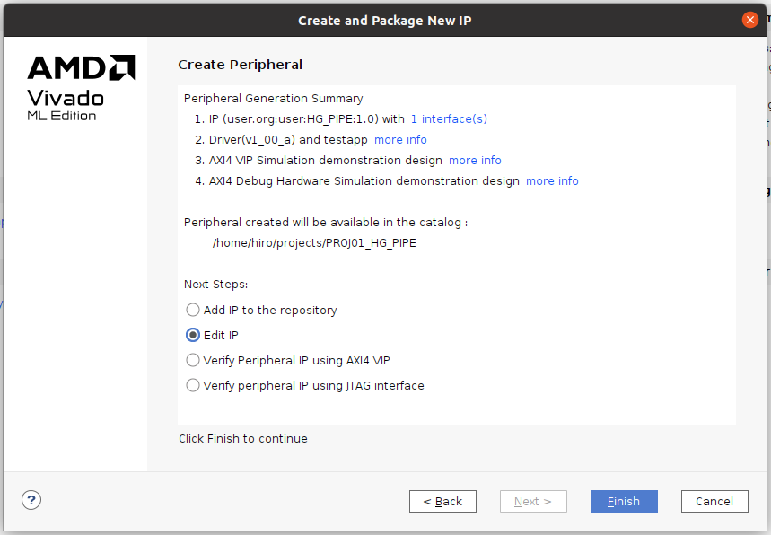
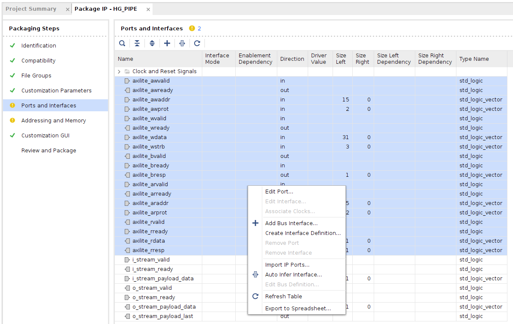
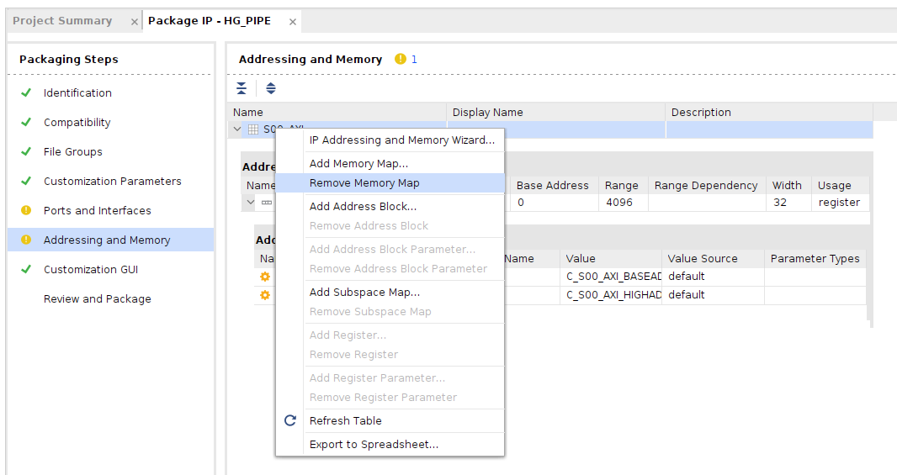
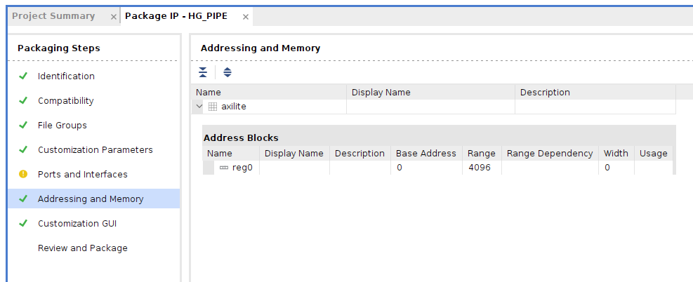
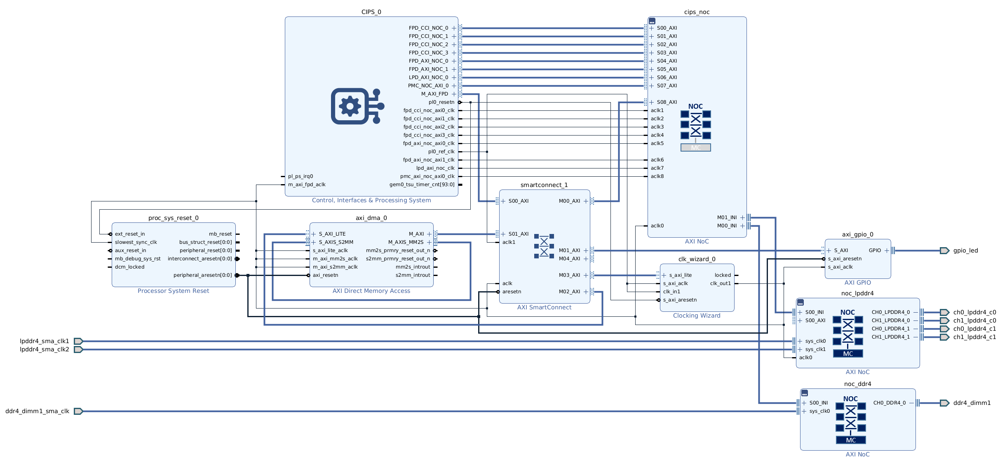
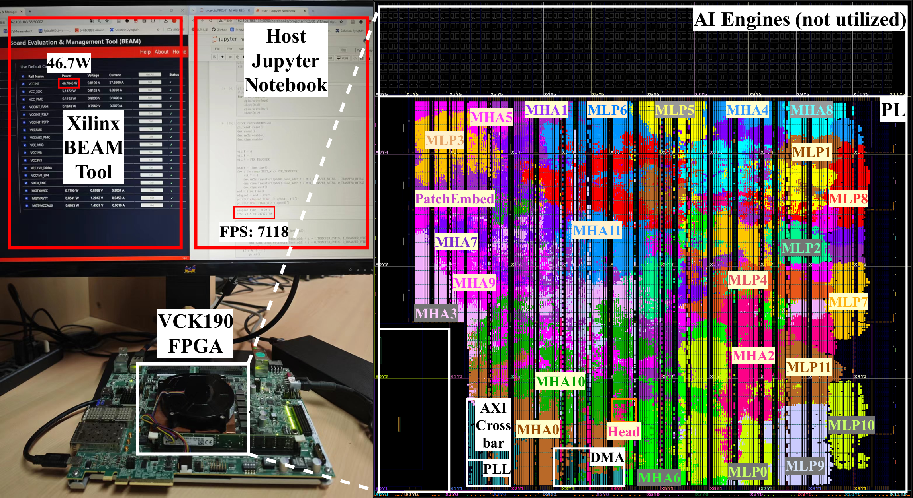

# HG-PIPE

<!--  -->
[English](README.md) | [中文](README.zh-CN.md)


**HG-PIPE** 是文章《Vision Transformer Acceleration with Hybrid-Grained Pipeline》的官方开源实现，是一个基于FPGA平台的ViT模型加速器。该项目旨在通过混合粒度流水线技术加速Vision Transformer模型的推理过程，实现极高的推理性能和能效。该项目不仅提供了加速器本身的实现，同时也提供了对应的验证手段和上板测试脚本工具。

---

## 加速器特性
<!-- 添加一个表格-->
| LUTs | DSPs | BRAMs | Frequency | FPS(ImageNet@224x224) | TOPs | GOPs/W | Accuracy |
|:----:|:----:|:-----:|:---------:|:---------------------:|:----:|:------:|:--------:|
|  669k|  312 | 1006.5| 425MHz    |7118                   | 17.8 |  381.0 |  71.05%  |

---

## 环境需求
- Vivado HLS 2020.1 或更新版本（推荐使用2023.2以获取更快的编译速度）
- Python 3
- IDEA + Scala（2.11.12） + Spinal（1.7.1）+ Verilator（4.228）

## 文件结构
该项目包含几个组件：(1) HLS设计文件，（2）用于运行Vitis HLS的Python脚本，（3）用于加速仿真和打包导出的SpinalHDL代码，（4）用于在FPGA上测试的jupyter notebook脚本。

```text
HG-PIPE/
├── src/                    # HLS设计文件
├── statistics/             # 神经网络的数据类型统计信息，作为模板参数
├── case/                   # 包含通过case generation生成的模块，以及组件的单元测试
│   ├── refs.7z             # 测试使用的golden data和神经网络权重数据压缩包，需解压
│   ├── ATTN.cpp.template   # Attention模块的模板文件
│   ├── MLP.cpp.template    # MLP模块的模板文件
│   ├── SOFTMAX_1X2.cpp     # Softmax组件的单元测试文件
│   ├── GELU.cpp            # GELU组件的单元测试文件
│   └── ...                 # ...
├── instances/              # 自动生成的文件夹，包含ViT各层实现的独立Vitis HLS项目
│   ├── proj_PATCH_EMBED    # Patch Embedding层项目
│   ├── proj_ATTN0          # Attention层项目（第0层）
│   ├── proj_ATTN1          # Attention层项目（第1层）
│   ├── ...                 # ...
│   ├── proj_MLP0           # MLP层项目（第0层）
│   ├── proj_MLP1           # MLP层项目（第1层）
│   ├── ...                 # ...
│   └── proj_HEAD           # Head层项目
├── SPINAl/                 # 用于快速仿真加速器、打包到Vivado环境的代码
│   └── ...                 # ...
├── notebooks/              # 用于在板上测试加速器的jupyter notebook脚本
├── constant.py             # 包含常量定义的Python文件
├── pre_syn_process.py      # 创建VitisHLS项目的Python脚本
├── pst_syn_process.py      # 收集HLS综合数据并支持其他流程的Python脚本
├── step0_~step5.py         # 整个流程需要执行的Python脚本
├── VCK190-bd-base.tcl      # 用于创建VCK190基础Block Design的TCL脚本
└── template.tcl            # 用于生成各个HLS项目的模板文件
```


## 快速开始
该项目主要包含6个步骤。如果你想跳过加速器的生成步骤，直接上板，可以从step4开始。

### Step0: Case Generation
在case目录下包含了ATTN模块和MLP模块的模板文件，通过运行step0_case_generation.py脚本，读取statistics目录下的统计信息，生成对应的cpp文件。在运行脚本前，请先解压case/refs.7z文件，其中包含了用于单元测试的golden data和神经网络权重数据。

```bash
python step0_case_generation.py
```

### Step1: HLS Simulation, Compilation, and Synthesis
通过运行step1_hls.py脚本，自动创建instances目录，并在其中生成各个层的Vitis HLS项目。

```bash
python step1_hls_flow.py
```

通过修改该脚本，你可以指定仅运行其中某些模块的流程，或者仅运行部分流程（如仅运行仿真）。请注意如果电脑内存不足64GB，请调低max_threads参数。

### Step2: Print Resource Usage
通过运行step2_print_resource.py脚本，可以打印出各个层的资源占用情况。

```bash
python step2_print_resource.py
```

运行结果：
```bash
instance                 SLICE     LUT       FF        DSP       BRAM      URAM      LATCH     SRL

proj_ATTN0               0         34559     29950     16        57        3         0         228
proj_ATTN1               0         34396     29903     16        57        3         0         227
...
proj_ATTN11              0         34281     30067     16        54        3         0         226
proj_HEAD                0         1689      1365      4         96        0         0         38
proj_MLP0                0         19174     13555     10        58        0         0         528
proj_MLP1                0         19027     13333     10        57        0         0         503
...
proj_MLP11               0         18996     13299     10        57        0         0         476
proj_PATCH_EMBED         0         8966      10031     428       178       0         0         687
```

### Step3: SpinalHDL Simulation and Packaging
通过使用SpinalHDL，我们提供了一个使用Verilator仿真的平台，以提供整个加速器的完整仿真，提升仿真速度。
为了使用SpinalHLD，需要使用Jetbrains的IDEA环境并且安装Scala插件。
请遵循SpinalHDL的官方文档安装环境兼容的Verilator ([https://spinalhdl.github.io/SpinalDoc-RTD/SpinalHDL/Getting%20Started/](https://spinalhdl.github.io/SpinalDoc-RTD/v1.3.1/SpinalHDL/Simulation/install.html))。
在IDEA中打开SPINAL目录，加载build.sbt文件以自动下载SpinalHDL的依赖项。

本项目中的Verilator仿真是使用Client-Server模式，使用Scala启动一个仿真server，用python通过socket将仿真参数传递给server，server返回仿真结果，因此在仿真前需要先启动server。

```text
Run "launch_spinal_server" function in src/test/scala/server/launch_spinal_server.scala
```

运行step3_spinal_flow.py脚本，将生成的各个项目的verilog代码复制到SPINAL目录下，并且并行运行所有层的仿真。

```shell
python step3_spinal_flow.py
```

这会打印所有层的仿真延迟，单位为周期数。整个加速器是流水线形式运行的，因此加速器延迟为最慢的层的延迟（57625周期）。

```text
Latency of PATCH_EMBED     is 56449
Latency of ATTN0           is 57625
Latency of MLP0            is 56449
Latency of ATTN1           is 57625
Latency of MLP1            is 56449
...
Latency of ATTN11          is 57625
Latency of MLP11           is 56449
Latency of HEAD            is 48001
```

本项目也提供了整个加速器的完整仿真：
```shell
Run "simulate_whole_network" function in src/test/scala/network/simulate_whole_network.scala
```

这将会消耗较长的时间，并产生下面的输出：
```text
Got 0
Got 1
...
Got 9
*** Simulation finished ***
***************************************************
This is 0 image.
First in to Last in:           55883
First out to Last out:         47811
First in to first out:         768773
Last in to last out:           760701
First in to Last out:          816584
***************************************************
......
***************************************************
This is 9 image.
First in to Last in:           57624
First out to Last out:         47811
First in to first out:         771109
Last in to last out:           761296
First in to Last out:          818920
Latency of i begin:            57625
Latency of i close:            57625
Latency of o begin:            57625
Latency of o close:            57625
***************************************************
[Done] Simulation done in 590469.695 ms
*** Total time is 889.5037027 seconds ***
*** Latency is 57624 ***
```

### Step4: IP Packaging and Vivado Implementation
为了将产生的各层设计文件打包到单个模块，请在IDEA环境中运行对应的代码：
```text
Run "generate_whole_network_verilog" function in src/main/scala/network/generate_whole_network_verilog.scala
```
这会产生BlockSequence.v和BlockSequence_bb.v两个文件，分别是加速器的顶层和打包的HLS模块。

接下来直接运行SPINAl目录下的to_vivado.py脚本，这会生成一个"vivado"文件夹，其中包含了打包IP所需的所有设计文件，包含verilog和初始化存储器文件：
```shell
cd SPINAL
python to_vivado.py
```

然后打开Vivado，选择Tools->Create and Package New IP，选择"Create a new AXI4 peripheral"，然后将上一步中"vivado"文件夹下的所有文件添加到source。
<!--添加几张图片-->




接下来的一部是自动推导接口。在"Packaging Steps"窗口中，点击"Ports and Interfaces"添加接口。选中所有"axilite"接口，然后选择"Auto Infer Interface"，然后选择"aximm_rtl"，点击OK。




而对于"i_stream"和"o_stream"接口，请在"Auto Infer Interface"中选择"axis_rtl"。当完成了所有接口的添加后，如下：


下一步是为打包的IP添加存储映射。先删除掉自动初始化的映射：



然后添加一个新的存储映射，点击"Addressing and Memory Wizard"，选择axilite接口以进行添加。再右键点击"axilite"接口，选择"Add Address Block"，填写block名称（如reg0），结果如下图：



最后点击"Review and Package"，点击"Re-Package IP"，然后保存IP。

打包完IP后，下一步是在Vivado中创建Block Design，构建一个完整的SoC，并添加刚刚打包的IP。请使用VCK190-bd-base.tcl脚本创建基本的Block Desgin：



这个基础的Block Design包含了一些基本组件，如PS、DMA、GPIO、DDR、LPDDR、Clocking Wizard等。其中，DMA是回环的。为了将加速器加入Block Design中，添加我们刚刚打包的IP，删除DMA从M_AXI_MM2S到S_AXIS_S2MM的连接，调整DMA的端口位宽（M和S都是32bit，与加速器一致），并且进行连接：


在创建完Block Design后，需要在Address Editor中分配地址。

最后，生成pdi文件，使用bootgen生成新的BOOT.BIN文件。为了保证达到最高的425MHz，请在设置中对Synthesis使用Flow_PerfOptimized_high，对Implementation使用Flow_ExploreWithRemap。论文中的测试结果和Placement如下：



### Step5: On-Board Testing

我们的设计不使用任何vendor-specific IP，因此可以支持不同的FPGA平台。我们提供了Jupyter Notebook，位于"notebooks"目录下，用于在板上测试加速器。请将该notebook和参考数据文件(refs)上传至测试版，并按照其中步骤进行。我们实现了一套类似于Pynq的机制用于在不支持Pynq的VCK190平台上控制各类硬件。在运行前，请检查notebook内容，保证正确的硬件地址（主要是加速器的硬件地址）。

## 引用
欢迎您引用我们ICCAD 2024的文章。

```bibtex
@inproceedings{hg-pipe,
  title={HG-PIPE: Vision Transformer Acceleration with Hybrid-Grained Pipeline},
  author={Guo, Qingyu and Wan, Jiayong and Xu, Songqiang and Li, Meng and Wang, Yuan},
  booktitle={Proceedings of the IEEE/ACM International Conference on Computer-Aided Design (ICCAD)},
  year={2024},
  publisher={IEEE/ACM},
  address={Newark, NJ, USA},
  note={To appear}
}
```