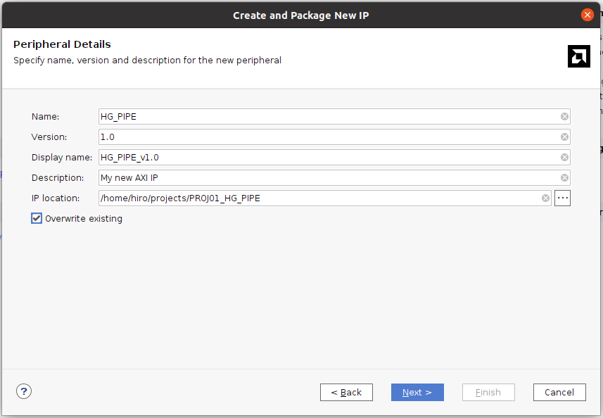
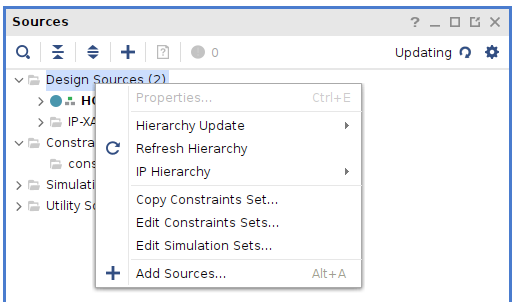
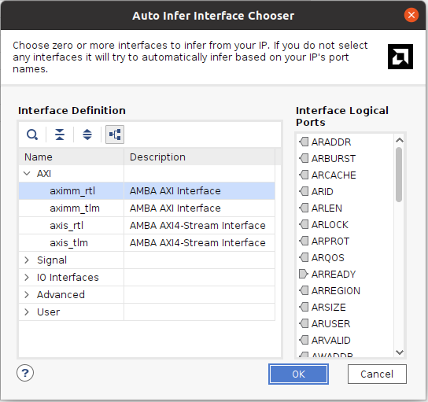
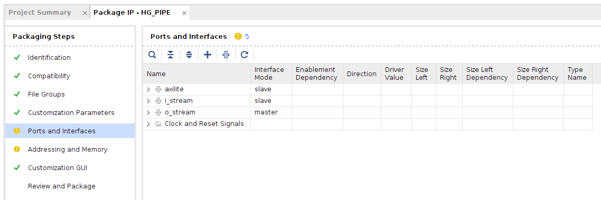
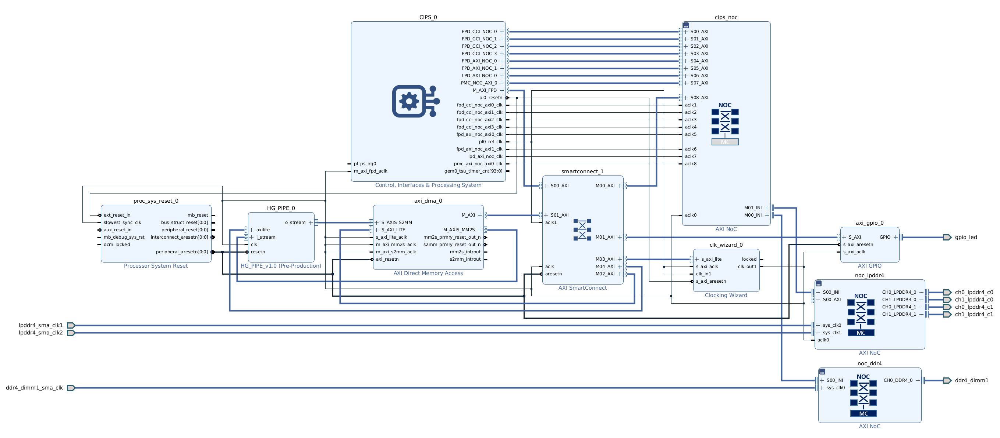

# HG-PIPE

<!--  -->
[English](README.md) | [中文](README.zh-CN.md)


**HG-PIPE** is the official open-source implementation of the paper "Vision Transformer Acceleration with Hybrid-Grained Pipeline." It is an FPGA-based accelerator for Vision Transformer (ViT) models. This project aims to accelerate the inference process of Vision Transformer models using hybrid-grained pipeline techniques, achieving outstanding inference performance and energy efficiency. The project provides the implementation of the accelerator as well as corresponding validation methods and on-board testing scripts.

---

## Accelerator Features
<!-- Add a table -->
| LUTs | DSPs | BRAMs | Frequency | FPS (ImageNet@224x224) | TOPs | GOPs/W | Accuracy |
|:----:|:----:|:-----:|:---------:|:----------------------:|:----:|:------:|:--------:|
|  669k|  312 | 1006.5| 425MHz    |7118                   | 17.8 |  381.0 |  71.05%  |

---

## Requirements
- Vivado HLS 2020.1 or later (recommended: 2023.2 for faster compilation)
- Python 3
- IDEA + Scala (2.11.12) + Spinal (1.7.1) + Verilator (4.228)

## File Structure
The project consists of several components: (1) HLS design files, (2) Python scripts for running Vitis HLS, (3) SpinalHDL code for accelerated simulation and exported packaging, and (4) Jupyter notebook scripts for FPGA on-board testing.

```text
HG-PIPE/
├── src/                    # HLS design files
├── statistics/             # Neural network data type statistics as template parameters
├── case/                   # Modules generated via case generation and component unit tests
│   ├── refs.7z             # Golden data and neural network weights for testing; needs extraction
│   ├── ATTN.cpp.template   # Template file for the Attention module
│   ├── MLP.cpp.template    # Template file for the MLP module
│   ├── SOFTMAX_1X2.cpp     # Unit test file for the Softmax component
│   ├── GELU.cpp            # Unit test file for the GELU component
│   └── ...                 # ...
├── instances/              # Auto-generated folder containing independent Vitis HLS projects for each ViT layer
│   ├── proj_PATCH_EMBED    # Patch Embedding layer project
│   ├── proj_ATTN0          # Attention layer project (layer 0)
│   ├── proj_ATTN1          # Attention layer project (layer 1)
│   ├── ...                 # ...
│   ├── proj_MLP0           # MLP layer project (layer 0)
│   ├── proj_MLP1           # MLP layer project (layer 1)
│   ├── ...                 # ...
│   └── proj_HEAD           # Head layer project
├── SPINAl/                 # Code for accelerated simulation and packaging for Vivado
│   └── ...                 # ...
├── notebooks/              # Jupyter notebook scripts for on-board accelerator testing
├── constant.py             # Python file containing constant definitions
├── pre_syn_process.py      # Python script for creating VitisHLS projects
├── pst_syn_process.py      # Python script for collecting HLS synthesis data and supporting other processes
├── step0_~step5.py         # Python scripts for the complete flow
├── VCK190-bd-base.tcl      # TCL script for creating the VCK190 base Block Design
└── template.tcl            # Template file for generating HLS projects
```

## Quick Start
The project consists of 6 main steps. If you want to skip the accelerator generation steps and directly proceed to on-board testing, start from Step 4.

### Step 0: Case Generation
The `case` directory contains template files for the ATTN and MLP modules. Run the `step0_case_generation.py` script to read statistics from the `statistics` directory and generate corresponding `.cpp` files. Before running the script, extract the `case/refs.7z` file, which contains golden data and neural network weights for unit testing.

```bash
python step0_case_generation.py
```

### Step 1: HLS Simulation, Compilation, and Synthesis
Run the `step1_hls.py` script to automatically create the `instances` directory and generate Vitis HLS projects for each layer.

```bash
python step1_hls_flow.py
```

Modify the script to specify certain modules or processes (e.g., simulation only). If your computer has less than 64GB of memory, reduce the `max_threads` parameter.

### Step 2: Print Resource Usage
Run the `step2_print_resource.py` script to print the resource usage of each layer.

```bash
python step2_print_resource.py
```

Output example:
```text
instance                 SLICE     LUT       FF        DSP       BRAM      URAM      LATCH     SRL

proj_ATTN0               0         34559     29950     16        57        3         0         228
proj_ATTN1               0         34396     29903     16        57        3         0         227
...
proj_ATTN11              0         34281     30067     16        54        3         0         226
proj_HEAD                0         1689      1365      4         96        0         0         38
proj_MLP0                0         19174     13555     10        58        0         0         528
proj_MLP1                0         19027     13333     10        57        0         0         503
...
proj_MLP11               0         18996     13299     10        57        0         0         476
proj_PATCH_EMBED         0         8966      10031     428       178       0         0         687
```

### Step 3: SpinalHDL Simulation and Packaging
Using SpinalHDL, we provide a simulation platform with Verilator to perform complete accelerator simulations, significantly improving simulation speed. 

To use SpinalHDL:
1. Install JetBrains IDEA with the Scala plugin.
2. Follow the SpinalHDL documentation to install a compatible version of Verilator ([SpinalHDL Installation Guide](https://spinalhdl.github.io/SpinalDoc-RTD/SpinalHDL/Getting%20Started/)).
3. Open the `SPINAL` directory in IDEA, load the `build.sbt` file, and download the required SpinalHDL dependencies.

Simulation uses a Client-Server model: the simulation server is launched via Scala, and Python scripts pass parameters to the server via sockets.

```text
Run "launch_spinal_server" function in src/test/scala/server/launch_spinal_server.scala
```

Run the `step3_spinal_flow.py` script to copy generated Verilog files to the `SPINAL` directory and simulate all layers in parallel.

```shell
python step3_spinal_flow.py
```

This script prints simulation latencies (in clock cycles) for each layer. Since the accelerator operates as a pipeline, the overall latency equals the slowest layer (e.g., 57625 cycles).

```text
Latency of PATCH_EMBED     is 56449
Latency of ATTN0           is 57625
Latency of MLP0            is 56449
Latency of ATTN1           is 57625
Latency of MLP1            is 56449
...
Latency of ATTN11          is 57625
Latency of MLP11           is 56449
Latency of HEAD            is 48001
```

For full accelerator simulation:
```shell
Run "simulate_whole_network" function in src/test/scala/network/simulate_whole_network.scala
```

This simulation takes longer and produces output like:
```text
Got 0
Got 1
...
Got 9
*** Simulation finished ***
***************************************************
This is 0 image.
First in to Last in:           55883
First out to Last out:         47811
First in to first out:         768773
Last in to last out:           760701
First in to Last out:          816584
***************************************************
......
***************************************************
This is 9 image.
First in to Last in:           57624
First out to Last out:         47811
First in to first out:         771109
Last in to last out:           761296
First in to Last out:          818920
Latency of i begin:            57625
Latency of i close:            57625
Latency of o begin:            57625
Latency of o close:            57625
***************************************************
[Done] Simulation done in 590469.695 ms
*** Total time is 889.5037027 seconds ***
*** Latency is 57624 ***
```

### Step 4: IP Packaging and Vivado Implementation
To package the generated layer designs into a single module, run:
```text
Run "generate_whole_network_verilog" function in src/main/scala/network/generate_whole_network_verilog.scala
```

This generates `BlockSequence.v` and `BlockSequence_bb.v`, which serve as the accelerator’s top module and packaged HLS modules.

Next, run the `to_vivado.py` script in the `SPINAL` directory to create a "vivado" folder containing all necessary design files, including Verilog and memory initialization files.

```shell
cd SPINAL
python to_vivado.py
```

Open Vivado, go to Tools -> Create and Package New IP, and select "Create a new AXI4 peripheral." Add all files from the "vivado" folder to the source.






Follow these steps to infer interfaces:
1. In the "Packaging Steps" window, click "Ports and Interfaces."

2. Select all `axilite` interfaces, click "Auto Infer Interface," choose `aximm_rtl`, and confirm.

3. For `i_stream` and `o_stream`, infer using `axis_rtl`.

After completing interface additions, the result should look like this:


For memory mapping:
1. Remove the auto-initialized mapping.

2. Add a new memory map via "Addressing and Memory Wizard."

3. Assign address blocks (e.g., reg0).

Finally, click "Review and Package," then "Re-Package IP," and save.

To integrate the IP into a Block Design:
1. Use `VCK190-bd-base.tcl` to create a base Block Design.

2. Add the packaged IP, reconfigure the DMA connections and bitwidths, and connect the accelerator to the design.


Assign addresses in the Address Editor, then generate the PDI file. Use `bootgen` to create the BOOT.BIN file. For optimal performance (425MHz), set "Flow_PerfOptimized_high" for synthesis and "Flow_ExploreWithRemap" for implementation.

Placement results and tests are shown below:


### Step 5: On-Board Testing
This design supports various FPGA platforms as it avoids vendor-specific IP. Jupyter notebooks in the "notebooks" directory facilitate on-board testing. Upload the notebook and reference data files (`refs`) to the test board and follow the steps. The notebooks implement a mechanism similar to PYNQ for VCK190 platform control. Verify hardware addresses before running the notebook.

## Citation
Feel free to cite our ICCAD 2024 paper.

```bibtex
@inproceedings{hg-pipe,
  title={HG-PIPE: Vision Transformer Acceleration with Hybrid-Grained Pipeline},
  author={Guo, Qingyu and Wan, Jiayong and Xu, Songqiang and Li, Meng and Wang, Yuan},
  booktitle={Proceedings of the IEEE/ACM International Conference on Computer-Aided Design (ICCAD)},
  year={2024},
  publisher={IEEE/ACM},
  address={Newark, NJ, USA},
  note={To appear}
}
```
